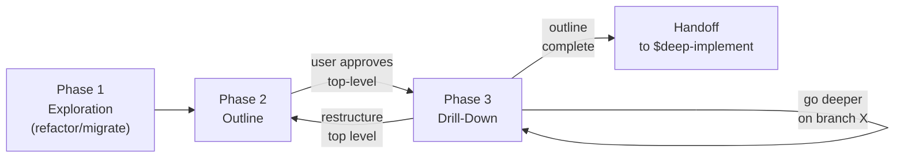

# Architect

A top-down, iterative code architecture skill. Works like writing an article: start with purpose, build an outline, drill down recursively, iterate until the structure is right, then hand off to implementation.

## Modes

| Mode | Trigger | Starting point |
|------|---------|---------------|
| **Refactor** | User points at existing code | Exploration agents extract what the system does, then design fresh |
| **Greenfield** | User describes something new to build | Lightweight kickoff questions, then draft outline |
| **Migrate** | User provides old code + new project target | Exploration agents extract requirements from old code, outline designs for new project |

## Scope Triage

Architect is heavyweight — only invoke at full depth when it earns the cost.

| Scope | Signal | What architect does |
|-------|--------|---------------------|
| **Trivial** | Single file, one new module, no architectural implications | Decline: "This doesn't need architect. Code it directly or use $simplify." |
| **Small** | 2-3 components, fits existing patterns, low uncertainty | Abbreviated: skip Phase 1 exploration if greenfield, one outline pass, no recursive drill-down |
| **Medium** | New subsystem, multiple components, real design decisions | Standard architect loop |
| **Large** | New system, major refactor, cross-cutting | Full architect with all phases |

Announce: "This looks like a [scope] task. I'll use [decline/abbreviated/standard/full] architect."

### Prototype escape hatch

If during exploration or outline you realize the design is speculative because the problem isn't well-understood, **stop and recommend a 50-200 line prototype** before continuing. Working code reveals shape that diagrams cannot.

## Invocation

The user invokes explicitly: `$architect <mode or description>`. Examples:

- `$architect refactor src/facility_matching`
- `$architect design a new ingestion pipeline for X`
- `$architect migrate old_project/src to this repo`

If the mode isn't clear from the arguments, ask: "Are we refactoring existing code, designing something new, or migrating from an old codebase?"

## Phase Overview

| Phase | Purpose | Reference |
|-------|---------|-----------|
| **1 — Exploration** | Scan existing code with 6 parallel agents (refactor/migrate only) | `references/phase-1-exploration.md` |
| **2 — Outline** | Produce top-level structure: purpose, mermaid diagram, component breakdown | `references/phase-2-outline.md` |
| **3 — Drill-Down** | Recursively expand branches until each leaf is a deep module | `references/phase-3-drill-down.md` |

**Design principles:** All structural decisions are informed by `references/design-principles.md`. Read it before Phase 2.

## Output

All artifacts go in `docs/plans/<name>-<date>-<id>/plan.md`:
- `<name>`: derived from the target (e.g. `refactor-facility-matching`, `design-ingestion-pipeline`)
- `<date>`: today's date as `YYYY-MM-DD`
- `<id>`: short random string (4-5 chars)

The outline document evolves through all phases. It contains:
- Statement of purpose
- Mermaid diagram(s)
- Structured markdown breakdown with component descriptions
- Domain entities (names + one-line descriptions)
- Cross-cutting concerns (patterns + which components use them)
- Current code anchors (refactor/migrate — where existing code lives)
- Findings appendix (refactor/migrate — design principle violations)

## Execution Notes

- **Parallel tool calls**: When reading multiple files or running independent searches, make all tool calls in parallel. Agents reason more and use tools less aggressively by default—explicitly parallelize independent reads.
- **Subagent mental test**: Before spawning a subagent, ask "Will I need this tool output again, or just the conclusion?" If only the conclusion matters, use a subagent with fresh context and pull back only the summary. If you'll need to reference the raw output repeatedly, do the work in the main thread (or save the raw output to disk and reference the file path).
- **Subagent prompt structure**: When feeding large documents (design principles, existing code, guidelines) to subagents, put the longform documents near the top of the prompt and the specific task/query at the end. This improves subagent performance by up to 30%.
- **Task packaging**: Specify the full task—intent, constraints, acceptance criteria, and relevant file locations—in the first turn. Avoid dribbling requirements across multiple turns; each turn adds reasoning overhead.
- **Minimalism guardrail**: When a design seems to add abstractions without hiding meaningful complexity, challenge it. The right amount of architecture is the minimum needed for the current problem.

## Core Working Principles

### The plan document is the source of truth

1. **Always write to disk first** — every diagram, every component description, every design decision goes into the plan document BEFORE appearing in conversation. The user needs to see mermaid diagrams rendered in their editor/previewer, not as raw text in chat.
2. **Never dump analysis into conversation without writing it to disk** — if you produce a diagram, a component breakdown, or an implementation sketch, it goes in the plan first. Then summarize briefly in conversation.
3. **Present a short summary/diff** in conversation after each update — not the full content, just what changed and where.
4. **User reviews in their editor** (or mermaid previewer for diagrams).
5. **Ask at checkpoints**: "Happy with this level? Or adjust before we go deeper?"

### Top-down, diagram-first

The fundamental working pattern is: **start at the highest level with a diagram, get the shape right, then zoom into individual components one at a time.**

1. **Start with the bird's-eye view** — a single mermaid diagram showing the major components and how they relate. Get this right before anything else.
2. **Map out components at the current level** — brief descriptions of what each does, what it hides, how it interfaces with others.
3. **Get user feedback on the shape** — don't drill deeper until the user confirms the current level makes sense.
4. **Zoom into the most complex or uncertain component** — expand it with its own diagram and sub-components.
5. **Repeat** — each zoom-in follows the same pattern: diagram first, then components, then feedback.

This is non-negotiable. Do not skip levels. Do not jump to implementation details before the structure is agreed.

### v1 is a requirements document, not a design document (refactor/migrate)

The user is refactoring because v1's structure is wrong — tangled, coupled, hard to change. Reproducing v1's module graph with cleaner names is not architecture.

**Use v1 to learn WHAT the system does:** workflows, business rules, invariants, edge cases, external interactions. This is the behavioral model — the requirements extracted from code.

**Design the new structure from first principles:** given those requirements, what's the cleanest architecture? Apply deep modules, information hiding, loose coupling. Don't look at v1's file layout while designing.

**Then reality-check against v1:** did you miss any hidden requirements? Any edge cases the behavioral model didn't capture? Adjust the design — but don't adopt v1's structure to do it.

The failure mode to avoid: the architect reads v1, deeply imprints its module graph into context, and unconsciously reproduces it in v2. The tangled coupling survives the "refactoring" because the architect never stepped back far enough to question it.

### Layer-by-layer abstraction — stay at the level

Design proceeds one abstraction layer at a time, from the entry point down to the infrastructure boundary. At each layer, design **all** components at that level before descending into any one of them.

**The descent:**
1. Start at `main()` — what are the top-level units? (e.g., two workflows: JobProcessor, CacheBuilder)
2. Design layer 1 in abstract terms — what does each unit do, what's its interface, how do they communicate? Don't think about databases or files yet.
3. Pick one unit, design its layer 2 — what are its internal components? (e.g., CacheBuilder has a decision tree that delegates to SnapshotStore, EventSource, FullRebuilder, IncrementalRebuilder). Still abstract — EventSource answers "are there changes?", it doesn't "query the database."
4. Continue descending until you reach the **infrastructure boundary** — the point where business abstractions give way to DB calls, file I/O, network requests, framework APIs. That's a leaf.

**The discipline: stay at the abstraction layer.** The most common failure mode is going concrete too soon. On the first pass, the temptation is to jump from "CacheBuilder checks for changes" directly to "run this SQL query." Resist. The intermediate abstraction (EventSource) is where the design value lives — it hides *how* changes are detected behind *what question is being asked*. Getting these intermediate layers right takes iteration; expect 2-3 passes before the abstractions feel natural.

**The leaf test:** You've reached a leaf when the component's implementation exits the business domain — it calls a database, reads a file, posts to a webhook, invokes an external library. Everything above that boundary should be expressible in business terms ("check for changes", "rebuild the cache", "score a candidate pair"), not infrastructure terms ("SELECT FROM source_record_events", "write parquet to S3").

**The judgment call:** Too many abstraction layers is also bad — each layer adds naming overhead, indirection, and cognitive load. The test is whether the abstraction hides meaningful complexity and reduces what callers need to know. If an abstraction layer is just forwarding calls without adding understanding, it's shallow and should be removed. A good intermediate abstraction changes the vocabulary: callers think in domain terms, the implementation thinks in infrastructure terms. If both sides speak the same language, the layer isn't earning its keep.

### Loose coupling and information hiding

When proposing the target architecture, actively design for:

- **Loose coupling** — components should communicate through narrow, well-defined interfaces. If two components share a lot of knowledge, they're too coupled. Look for ways to make them independent (shared data stores, message passing, query interfaces).
- **Information hiding** — each component should hide its implementation details behind a clean interface. Callers should never need to know the internal data structures, algorithms, or storage mechanisms. If the backing store could change (e.g., in-memory dicts → Redis), only the component itself should need to change.
- **Query interfaces over data exposure** — instead of exposing raw data structures (dicts, DataFrames, indices), expose query methods that answer questions. This keeps consumers independent of the implementation.

When reviewing a proposed component boundary, ask: "If I replaced the internals of this component, would its consumers need to change?" If yes, the boundary is leaking.

## Project-Local Guidelines Discovery

At the start of every session, look for project-specific conventions:

1. Read `AGENTS.md` (or `CLAUDE.md`, `GEMINI.md`) in the project root
2. Search for `docs/guidelines/`, `docs/architecture/`, or similar directories
3. If found, incorporate relevant conventions into the outline — these inform implementation tasks

These project-local guidelines complement the embedded design principles in `references/design-principles.md`.

## Phase Transitions

- **Phase 1 → Phase 2**: After all exploration subagents complete and findings are synthesized
- **Phase 2 → Phase 3**: After user explicitly approves the top-level structure
- **Phase 3 → Handoff**: After all branches are at leaf depth (or user is satisfied)

Read the relevant phase reference file when entering each phase. Don't load all references upfront.

## Handoff

`$deep-implement` is a separate skill that takes a completed architecture plan and turns it into an implementation plan with concrete tasks, commits, and validation steps. It reads the plan document produced by `$architect` as its input.

### Readiness checklist

Before suggesting handoff, verify:

- [ ] **All diagrams are current** — no stale references, labels match the text
- [ ] **Every leaf component has:** Purpose, Interface (or query methods), and what it Hides
- [ ] **No unresolved TODOs or open questions** in the plan document
- [ ] **Superseded sections are marked** — not silently stale
- [ ] **Domain entities table is complete** — all entities discovered during drill-down are listed
- [ ] **New artifacts / data structures are documented** — anything the implementation needs to create
- [ ] **Dead code is identified** — modules that will be removed or replaced

When the checklist passes, suggest:

> "The outline is finalized. To plan and execute the implementation, run:
> `$deep-implement` and point it at `docs/plans/<path>/plan.md`"

Do not auto-invoke `$deep-implement`. The user decides when and how to proceed.

## Greenfield Kickoff

For greenfield mode (no existing code to scan), gather essentials with 2-3 lightweight questions before producing the first outline draft. See `references/phase-2-outline.md` for the full kickoff procedure.

## Depth Control

Expansion stops when a node is a **deep module** (simple interface, meaningful hidden complexity). Expansion continues when a node has multiple responsibilities, vague interfaces, or is too large for one implementation task. See `references/phase-3-drill-down.md` for the full depth control criteria.

**User override always wins**: "go deeper on X" or "that's enough detail."
