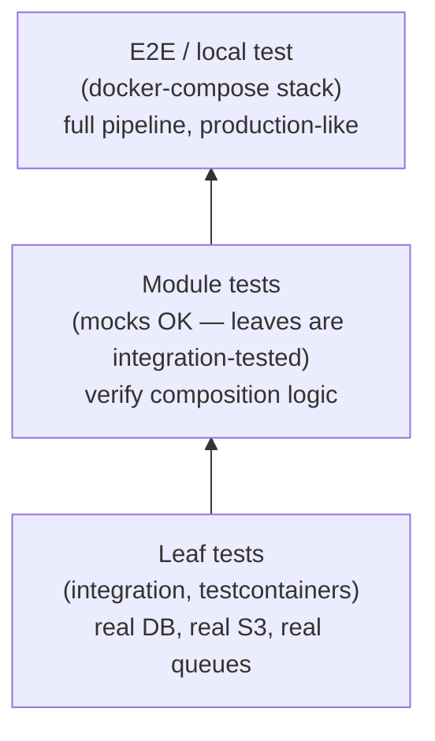

# Testing Strategy

Tests are written **bottom-up** after **top-down** implementation. You can't test a skeleton — you test completed code.

## Test Pyramid



### Leaf tests (integration)

Each leaf component gets integration tests using testcontainers:

- **Real databases** — Postgres via testcontainers, seeded with representative data
- **Real object storage** — LocalStack S3, with actual read/write operations
- **Real queues** — LocalStack SQS, with actual send/receive
- **No mocks at this level** — the leaf is the most concrete unit. If it works against real infrastructure, it works.

Why integration at the leaf level: leaves contain the actual logic — SQL queries, S3 operations, feature extraction, scoring algorithms. Mocking these hides the bugs that matter most (wrong query, wrong S3 path, wrong serialization format).

**Prefer real infrastructure over mocks.** Docker + testcontainers is cheap. If a function talks to a database, test it against a real database (testcontainers-postgres). If it talks to S3, test against LocalStack. Don't mock cursors, connections, or SDK clients when you can run the real thing. Mocks are acceptable only for:
- External services you genuinely can't run locally (third-party APIs with auth, paid services)
- Module composition tests (Layer 3+) where leaves are already integration-tested

### Module tests (composition)

After all leaves of a module are integration-tested, test the module itself:

- **Mocks are fine** — the module's job is to wire leaves together. The leaves are already proven to work against real infrastructure.
- **Test the composition** — verify that the module calls the right leaves in the right order with the right arguments.
- **Test error handling** — verify that the module handles leaf failures correctly.
- **Don't re-test leaf behavior** — if a leaf's integration test covers a scenario, the module test doesn't need to cover it again.

### E2E / local test

A docker-compose stack that mirrors production as closely as possible:

- All real services (Postgres, LocalStack, Mailpit for email, etc.)
- Init script that seeds realistic test data at production-like scale
- End-to-end test that exercises the full pipeline from input to output
- Test data consistency — IDs, foreign keys, and cross-references match

This validates:
- Service startup and configuration
- End-to-end data flow through all components
- Integration between components that were tested with mocks at the module level
- Realistic timing and resource usage

See `docs/local-tests/` in the project for the established pattern.

## When to write tests

| Implementation phase | Testing action |
|---|---|
| Phase 1: Skeleton | No tests. Skeletons have `# TODO` — nothing to test. |
| Phase 2: Leaf completed | Write integration tests for that leaf immediately. |
| Phase 2: All leaves of a module done | Write module composition tests. |
| Phase 2: All components done | All leaf + module tests should pass. |
| After each test batch | Run review agent: sanity, coverage, fixture quality, insights. |
| Phase 4: Local test | Create docker-compose stack + init script + E2E test. |

## Test file organization

**No artificial unit vs integration separation.** Don't separate tests into `tests/unit/` and `tests/integration/` folders. Don't use `@pytest.mark.integration` markers. All tests are just tests. Testcontainer startup is fast (~2-4 seconds) and session-scoped, so there's no meaningful speed penalty. If larger E2E tests emerge later that need separate treatment, deal with that then — don't pre-optimize the structure.

**Mirror the production package structure.** Test files should mirror the production code's directory hierarchy under `tests/`. If production code lives at `my_package/workflows/cache_builder/streaming.py`, the test lives at `tests/workflows/cache_builder/test_streaming.py`. Top-level modules (e.g. `my_package/parsing.py`) stay at `tests/test_parsing.py`. This makes it immediately obvious which production module a test covers, and scales naturally as the package grows — no reorganization needed when subpackages are added.

```
# Production                              # Tests
my_package/                               tests/
├── parsing.py                            ├── test_parsing.py
├── config.py                             ├── test_config.py
├── workflows/                            ├── workflows/
│   ├── cache_builder/                    │   ├── cache_builder/
│   │   ├── streaming.py                  │   │   ├── test_streaming.py
│   │   └── snapshot.py                   │   │   └── test_snapshot.py
│   └── ingest/                           │   └── ingest/
│       └── pipeline.py                   │       └── test_pipeline.py
└── storage/                              ├── storage/
    ├── s3.py                             │   ├── test_s3.py
    └── dynamo.py                         │   └── test_dynamo.py
                                          └── conftest.py
```

Directory layout:
- `tests/` — all tests (leaf integration + module composition), mirroring production structure
- `tests/conftest.py` — root conftest with session-scoped container fixtures
- `docker/docker-compose.local-test-<pipeline>.yml` — E2E stack
- `docker/local-test-<pipeline>-init.py` — E2E data seeding
- `docs/local-tests/<pipeline>.md` — E2E documentation

## What to test (and what to skip)

**Test only behavior, not data.** Pure data definitions (dataclasses, type aliases, constants with no logic) don't need tests. Only test modules that contain behavior (functions, methods, state machines). If a module is just dataclass definitions, skip it. If a module mixes data and behavior, consider splitting it: data definitions in one file, behavior (parsing, validation, etc.) in another. The split makes the "no tests needed" decision obvious and keeps both files focused.

## Container fixture scoping

**Session-scope container fixtures from the start.** Container fixtures (LocalStack, Postgres) should be session-scoped in the root `conftest.py` from the beginning. Don't scope them per-module — that spins up redundant containers. Lightweight per-test isolation (fresh buckets, schema resets) is function-scoped.

```python
# tests/conftest.py — session-scoped containers
@pytest.fixture(scope="session")
def postgres_container():
    with PostgresContainer("postgres:16") as pg:
        yield pg

@pytest.fixture(scope="session")
def localstack_container():
    with LocalStackContainer() as ls:
        yield ls

# Per-test isolation — function-scoped
@pytest.fixture
def fresh_bucket(localstack_container):
    bucket = f"test-{uuid4().hex[:8]}"
    s3 = localstack_container.get_client("s3")
    s3.create_bucket(Bucket=bucket)
    yield bucket
    # cleanup
```

## Post-batch review checkpoint

After each batch of tests is written and passing, stop and run a dedicated review agent to check:
- **Test sanity and coverage** — missing edge cases, redundant tests, assertions that don't actually verify anything meaningful
- **Test infrastructure quality** — fixture scoping, factory patterns, helper duplication
- **Architectural insights** — things discovered by reading and testing the code that might feed back into the implementation

Present findings conversationally to the user. Act on agreed improvements before moving to the next batch. This is analogous to the review checkpoints between implementation phases.
