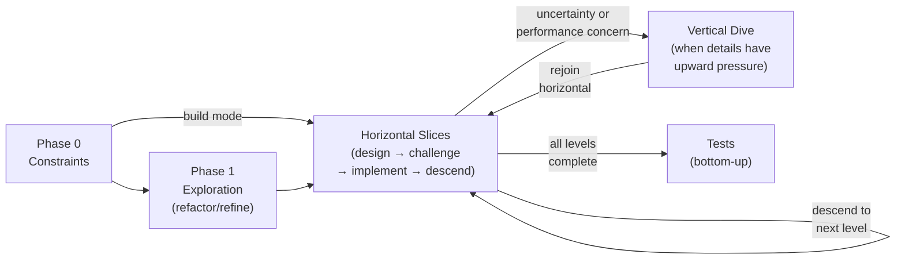

# Forge

Builds clean, well-structured code through iterative, top-down construction. Works in horizontal slices — design all components at one abstraction level, validate, implement, then descend to the next level. Uses fresh-context agents for implementation and independent challenger agents for validation.

The destination is code where every component does one thing, every layer speaks at one level of granularity, and business logic never tangles with infrastructure.

## Modes

| Mode | Trigger | Starting point |
|------|---------|---------------|
| **Build** | User describes something new | Kickoff questions → constraints → design |
| **Refactor** | User points at existing code to restructure | Explore existing code → extract requirements → design fresh |
| **Refine** | User points at working code to improve | Read code → diagnose structural issues → iterative improvement |

## Invocation

`/forge <mode or description>`. Examples:

- `/forge build an ingestion pipeline for X`
- `/forge refactor src/facility_matching`
- `/forge refine actors/snapshot/`

If the mode isn't clear, ask: "Are we building something new, refactoring existing code, or refining working code?"

## Scope Triage

Every request starts here. Assess before committing to workflow depth:

| Scope | Signal | What forge does |
|-------|--------|----------------|
| **Trivial** | Single function, one file, no architectural implications | Decline: "This doesn't need forge. Just do it directly." |
| **Small** | 2-3 files, clear structure, fits existing patterns | Abbreviated: skip Phase 0, one horizontal slice, quick challenger pass |
| **Medium** | New feature or module, multiple components, needs design | Standard forge loop |
| **Large** | New system, major refactor, cross-cutting restructuring | Full forge with heavy user involvement early |

Announce: "This looks like a [scope] task. I'll use [abbreviated/standard/full] forge. Sound right?"

### Prototype Escape Hatch

If — at any point during forge — the design feels speculative because the problem isn't well-understood:

**Stop. Recommend a 50-200 line prototype instead of continued design.**

Working code reveals shape that diagrams cannot. The prototype is throwaway — its purpose is to surface constraints you couldn't see from the outside. After the prototype, return to forge with a sharper sense of what the system needs to be.

Signals you need a prototype, not more design:
- "I'm not sure if X is feasible at this layer"
- "We're guessing at the data shape"
- "The interface depends on how Y behaves under load"
- The user keeps reframing requirements

A prototype that runs is worth a hundred diagrams.

## Phase Overview



| Phase | Purpose | Reference |
|-------|---------|-----------|
| **0 — Constraints** | Gather architecture-shaping facts (data scale, performance, infrastructure) | `references/phase-0-constraints.md` |
| **1 — Exploration** | Scan existing code, extract behavioral model (refactor/refine only) | `references/phase-1-exploration.md` |
| **Horizontal Slices** | The core loop: design all components at level N → challenge → implement → descend | `references/horizontal-slice.md` |
| **Tests** | Bottom-up testing after top-down implementation | `references/testing-strategy.md` |

**Design principles:** All structural decisions are informed by `references/design-principles.md`. Read it before the first horizontal slice.

**Challenger protocol:** Validation at each step uses `references/challenger-protocol.md`.

**Exemplars and corrections:** Progressive learning from user feedback uses `references/exemplars-and-corrections.md`.

## Execution Notes

- **Parallel subagents**: Launch explorer and implementer subagents in parallel when tasks are independent. Spawn multiple subagents in the same turn when fanning out across files or components. Do not spawn a subagent for work you can complete directly in a single response.
- **Parallel tool calls**: When reading multiple files or running independent searches, make all tool calls in parallel. Agents reason more and use tools less aggressively by default—explicitly parallelize independent reads.
- **Literal scope**: State explicitly when instructions apply broadly (e.g., "Apply this pattern to *every* component at this level, not just the first one").
- **Minimalism guardrail**: During design and implementation, challenge unnecessary abstractions. Only add a layer/type/helper if it hides meaningful complexity or is used more than once.
- **Context hygiene**: Use fresh-context subagents for exploration and implementation to prevent main-thread bloat. The orchestrator holds state and talks to the user; subagents handle heavy tool use.
- **Subagent mental test**: Before spawning a subagent, ask "Will I need this tool output again, or just the conclusion?" If only the conclusion matters, the subagent should return a tight summary and leave the raw exploration in its own context. If you'll need to reference detailed output repeatedly, write it to disk (e.g., `plan.md` or `progress.md`) and reference the file path.
- **Proactive checkpointing**: If exploration or a horizontal slice involves extensive tool use, write `progress.md` mid-flight rather than waiting for the slice to finish. This preserves state if context compacts or the session is interrupted.

## The Forge Loop

The fundamental working pattern:

```
Phase 0: Constraints Discovery
  → Gather the physics of the problem
  → Output: constraints section in plan.md

Phase 1: Exploration (refactor/refine only)
  → Fresh agents scan existing code
  → Extract WHAT the system does, not HOW it's organized
  → Output: behavioral model in plan.md

Horizontal Slice at Level 1 (top level):
  1. DESIGN all top-level components (diagram + interfaces)
  2. CHALLENGE with fresh agent (structural quality check)
  3. User REVIEWS, corrects, approves
  4. IMPLEMENT skeletons for all components at this level
  5. Mark EXEMPLARS, log CORRECTIONS
  6. DESCEND to next level

Horizontal Slice at Level 2:
  Same loop, but referencing exemplars from Level 1.
  User involvement lighter — patterns emerging.

Horizontal Slice at Level N:
  Progressive autonomy — skill references rich exemplar
  and corrections set. User spot-checks.

Vertical Dives (opportunistic, at any level):
  When a component has performance implications, constraint
  uncertainty, or details that would reshape the level above.

Tests:
  Bottom-up after all levels are stable.
```

## Progressive Autonomy

The skill starts in "teaching mode" and gradually shifts to "autopilot" as it learns from user feedback.

| Phase | Signal | User involvement | Skill behavior |
|-------|--------|-----------------|----------------|
| **Bootstrapping** | No exemplars, no corrections | Heavy — user co-designs and co-implements | Asks for approval at every step. Prompts for correction logging. |
| **Pattern emerging** | 1-2 exemplars, corrections accumulating | Medium — user approves designs, reviews implementations | Proposes designs referencing exemplars. "This follows the pattern from X — look right?" |
| **Pattern established** | Exemplars cover all layers, corrections log rich | Light — user spot-checks | "I'll implement this following established patterns. I'll show you the result." |
| **Autopilot** | User explicitly says "go" | Minimal — user reviews at milestones | Implements autonomously, runs challenger, presents at checkpoints. |

The shift is driven by the corrections log: when corrections are frequent, stay in heavy mode. When they dry up, propose lighter involvement. **Always ask before shifting** — never silently reduce user involvement.

See `references/exemplars-and-corrections.md` for the full protocol.

## The Horizontal Discipline Rule

**This is non-negotiable.**

When working on a horizontal slice at level N:

- Change ONLY components at level N
- Do NOT chase downstream breakages at level N+1, N+2, etc.
- Do NOT update callers, fix imports, or repair tests for lower levels
- Do NOT "make it compile" by modifying things outside the current level
- It is EXPECTED that the project may be temporarily broken
- Note breakages in `progress.md` as "will resolve at level N+1"

The project will be un-compilable between horizontal slices. This is fine. Resist the urge to fix it. You will get to those levels. Fixing them now is wasted work — the design at that level hasn't been decided yet.

**Why agents violate this:** Agents have a strong prior toward "leave the project in a working state after every change." This is good advice for normal coding. It is terrible advice during architectural reshaping. Broken downstream code is a sign you're doing it right — the old shape no longer fits the new one.

**The exception:** If a downstream fix is trivial (rename an import) AND you're already looking at that file, do it. But never open a file at a lower level just to fix breakages.

## Agent Architecture

| Role | Who | Fresh context? | When |
|------|-----|---------------|------|
| **Orchestrator** | Main conversation | No — persistent | Always. Holds state, talks to user, coordinates. |
| **Explorer** | Subagent (opus) | Yes | Phase 0 + Phase 1: scan code, discover constraints |
| **Challenger** | Subagent (opus) | Yes — always fresh | After each design or implementation: skeptical review |
| **Implementer** | Subagent (opus) | Yes — fresh | Each implementation pass: write code |

The challenger being **always fresh** is critical. The agent doing the work cannot judge its own work — a fresh agent with no investment in the output is more honest. This is the key lesson from Anthropic's harness design research: separating generation from evaluation, and tuning the evaluator to be skeptical rather than lenient.

The implementer being fresh prevents context drift on long sessions.

### Subagent prompts must include:

- The specific task and expected output
- Paths to plan.md, exemplars.md, corrections.md
- The project's working directory
- Constraints from CLAUDE.md / AGENTS.md
- For implementers: "Read exemplar files FIRST, then match their patterns"
- For challengers: "Be skeptical. Your job is to find problems, not approve work."

## Output Artifacts

All artifacts live in `.docs/plans/<name>/`:

```
.docs/plans/<name>/
├── plan.md            # Architecture: constraints, diagrams, components. Evolves with each level.
├── exemplars.md       # User-validated reference files with descriptions
├── corrections.md     # Correction log: CORRECTION → LESSON with WHY
├── progress.md        # Current level, completed work, next steps, breakage notes
```

- `<name>`: derived from the target (e.g., `forge-ingestion-pipeline`, `refactor-facility-matching`)

The plan document is the source of truth. Write to disk first, then summarize in conversation. The user reviews in their editor, not in chat.

## Plan Document Structure

```markdown
# <Name>

## Purpose
<What this code does, who it serves, why it exists>

## Constraints
<Architecture-shaping facts from Phase 0>
- Data: <scale, growth>
- Performance: <requirements, SLAs>
- Infrastructure: <available services, limits>
- Implication: <what this means for the architecture>

## What This System Does (refactor/refine only)
<Behavioral model from Phase 1: workflows, business rules, I/O>

## Target State — Level 1
<Mermaid diagram — top-level components>

### <Component 1>
**Purpose:** <one sentence>
**Interface:** <typed signatures>
**Hides:** <internal complexity>

### <Component 2>
...

## Target State — Level 2
<Expands each Level 1 component with internal structure>

## Domain Entities
| Entity | Description |
|--------|-------------|

## Cross-Cutting Concerns
<Patterns that span components>
```

## Vertical Dive Triggers

The skill should proactively flag when a component likely has "upward pressure":

- "This component processes 120M records — the streaming pattern might affect how the orchestrator passes data. Worth diving deep first?"
- "This talks to 3 external APIs with different auth — error handling strategy might affect the service layer."
- "This has a complex algorithm that might not fit the interface we designed — let me prove it out."

The user can always request a vertical dive: "Go deep on X before continuing."

## Core Working Principles

### The plan document is the source of truth

1. **Write to disk first** — every diagram, component description, design decision goes into plan.md BEFORE appearing in conversation.
2. **Never dump analysis into conversation without writing to disk.**
3. **Present a short summary/diff** in conversation after each update.
4. **User reviews in their editor.**
5. **Ask at checkpoints**: "Happy with this level? Or adjust before we descend?"

### v1 is a requirements document, not a design document (refactor)

The user is refactoring because v1's structure is wrong. Use v1 to learn WHAT the system does. Design the new structure from first principles. Then reality-check against v1.

The failure mode: deeply imprint v1's module graph and unconsciously reproduce it. The tangled coupling survives the "refactoring" because you never stepped back far enough to question it.

### Layer-by-layer abstraction

At each layer, code works at one level of granularity:

- **Orchestration layer**: Describes business flow in abstract terms. "Build snapshot, publish it, notify."
- **Service/coordination layer**: Coordinates pipeline steps. "Stage sources, resolve studies, assemble."
- **Infrastructure layer**: Does the actual dirty work. "Stream JSONL from S3, batch-insert into SQLite, execute SQL."

A component EITHER describes a business flow in abstract terms OR does actual dirty work (queries, network calls, file I/O). Never both in the same component.

**The leaf test:** You've reached a leaf when the component's implementation exits the business domain — it calls a database, reads a file, posts to a webhook, invokes an external library. Everything above that boundary should be expressible in business terms.

## Project-Local Guidelines Discovery

At the start of every session:

1. Read `CLAUDE.md` (or `AGENTS.md`, `GEMINI.md`) in the project root
2. Search for `docs/guidelines/`, `docs/architecture/`, or similar
3. If found, incorporate into agent prompts — these inform structural decisions

## Relationship to Other Skills

| Skill | Relationship |
|-------|-------------|
| `/forge` | **This skill.** Build, refactor, or refine code with architectural intent. |
| `/deep-implement` | Coexists. Problem → investigation → proposal → implementation. Different trigger (reactive to a problem/review, not proactive construction). |
| `/mega-review` | Feeds into forge. Review findings can trigger a `/forge refine`. |
| `/grill-me` | Complementary. Use before forge to stress-test a design idea. |
| `/cross-examine` | Complementary. Use to understand existing code before forge. |
