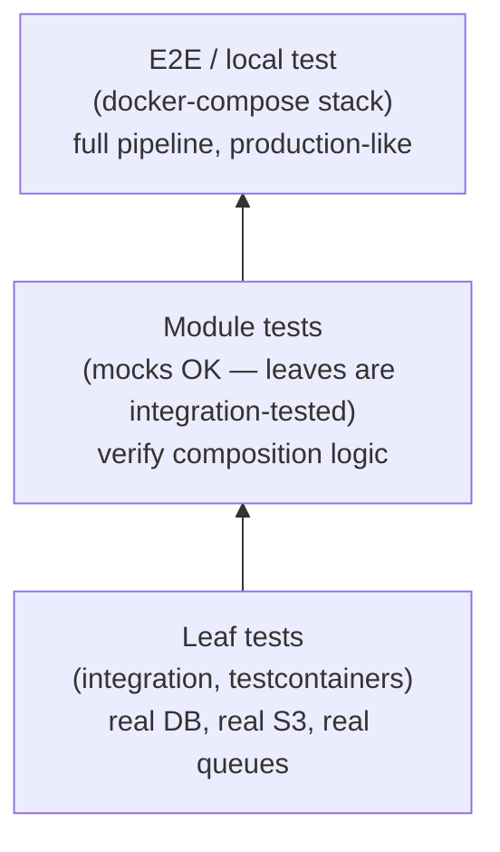

# Testing Strategy

Tests are written **bottom-up** after **top-down** implementation. You can't test a skeleton — you test completed code. And you don't test during architectural reshaping — you test when the shape is stable.

## When to Write Tests

| Forge phase | Testing action |
|---|---|
| Horizontal slices (architecture in flux) | NO tests. Skeletons and partially-implemented code can't be tested meaningfully. Tests written now will break when you descend. |
| All horizontal slices complete (architecture stable) | Start bottom-up testing. Leaves first, then modules, then E2E. |
| After each test batch | Run review agent: sanity, coverage, fixture quality. |

**The key insight:** During forge construction, the project is intentionally broken between horizontal slices. Writing tests for broken code is wasted effort. Wait until all levels are implemented, then test.

**Exception:** If a specific component is fully implemented (all the way to leaf) during a vertical dive, you may test it immediately. But only if its interfaces are stable — if the level above might still change, wait.

## Test Pyramid



### Leaf tests (integration)
Each leaf component gets integration tests using testcontainers:
- **Real databases** — Postgres via testcontainers
- **Real object storage** — LocalStack S3
- **Real queues** — LocalStack SQS
- **No mocks at this level** — the leaf is the most concrete unit. If it works against real infrastructure, it works.

Why integration at the leaf: leaves contain the actual logic — SQL queries, S3 operations, scoring algorithms. Mocking these hides the bugs that matter most.

### Module tests (composition)
After leaves are integration-tested, test module composition:
- **Mocks are fine** — leaves are already proven
- **Test the wiring** — right leaves called in right order with right arguments
- **Test error handling** — module handles leaf failures correctly
- **Don't re-test leaf behavior**

### E2E / local test
Docker-compose stack mirroring production:
- All real services
- Init script with realistic test data
- End-to-end test exercising the full pipeline

## What to Test (and What to Skip)

**Test behavior, not data.** Pure data definitions (dataclasses, type aliases, constants) don't need tests. Only test modules with behavior.

If a module mixes data and behavior, consider splitting: data definitions in one file, behavior in another. The split makes "no tests needed" obvious.

## Test Organization

Mirror the production package structure under `tests/`. No artificial unit/integration separation.

```
# Production                        # Tests
my_package/                         tests/
├── workflows/                      ├── workflows/
│   ├── snapshot/                   │   ├── snapshot/
│   │   ├── builder.py              │   │   ├── test_builder.py
│   │   └── staging/                │   │   └── staging/
│   │       ├── crm.py              │   │       ├── test_crm.py
│   │       └── studies.py          │   │       └── test_studies.py
│   └── scoring/                    │   └── scoring/
│       └── scorer.py               │       └── test_scorer.py
└── types/                          └── conftest.py
    └── snapshot.py
```

## Container Fixtures

Session-scope container fixtures from the start in root `conftest.py`. Per-test isolation (fresh buckets, schema resets) is function-scoped.

## Post-Batch Review

After each test batch, run a review agent:
- Test sanity and coverage
- Test infrastructure quality (fixtures, factories)
- Architectural insights from testing

Present findings to user. Act on agreed improvements before next batch.
