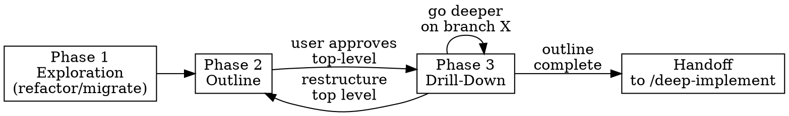

# Architect

A top-down, iterative code architecture skill. Works like writing an article: start with purpose, build an outline, drill down recursively, iterate until the structure is right, then hand off to implementation.

## Modes

| Mode | Trigger | Starting point |
|------|---------|---------------|
| **Refactor** | User points at existing code | Six exploration agents scan the code, produce initial outline |
| **Greenfield** | User describes something new to build | Lightweight kickoff questions, then draft outline |
| **Migrate** | User provides old code + new project target | Exploration agents scan old code, outline targets new project |

## Invocation

The user invokes explicitly: `/architect <mode or description>`. Examples:

- `/architect refactor src/facility_matching`
- `/architect design a new ingestion pipeline for X`
- `/architect migrate old_project/src to this repo`

If the mode isn't clear from the arguments, ask: "Are we refactoring existing code, designing something new, or migrating from an old codebase?"

## Phase Overview

| Phase | Purpose | Reference |
|-------|---------|-----------|
| **1 — Exploration** | Scan existing code with 6 parallel agents (refactor/migrate only) | `references/phase-1-exploration.md` |
| **2 — Outline** | Produce top-level structure: purpose, mermaid diagram, component breakdown | `references/phase-2-outline.md` |
| **3 — Drill-Down** | Recursively expand branches until each leaf is a deep module | `references/phase-3-drill-down.md` |

**Design principles:** All structural decisions are informed by `references/design-principles.md`. Read it before Phase 2.

## Output

All artifacts go in `docs/plans/<name>-<date>-<id>/plan.md`:
- `<name>`: derived from the target (e.g. `refactor-facility-matching`, `design-ingestion-pipeline`)
- `<date>`: today's date as `YYYY-MM-DD`
- `<id>`: short random string (4-5 chars)

The outline document evolves through all phases. It contains:
- Statement of purpose
- Mermaid diagram(s)
- Structured markdown breakdown with component descriptions
- Domain entities (names + one-line descriptions)
- Cross-cutting concerns (patterns + which components use them)
- Current code anchors (refactor/migrate — where existing code lives)
- Findings appendix (refactor/migrate — design principle violations)

## Interaction Pattern

1. **Always write to disk first** — the document lives on disk, not in conversation
2. **Present a summary/diff** in conversation after each update
3. **User reviews in their editor** (or mermaid previewer for diagrams)
4. **Ask at checkpoints**: "Happy with this level? Or adjust before we go deeper?"

## Project-Local Guidelines Discovery

At the start of every session, look for project-specific conventions:

1. Read `CLAUDE.md` (or `AGENTS.md`, `GEMINI.md`) in the project root
2. Search for `docs/guidelines/`, `docs/architecture/`, or similar directories
3. If found, incorporate relevant conventions into the outline — these inform implementation tasks

These project-local guidelines complement the embedded design principles in `references/design-principles.md`.

## Phase Transitions

- **Phase 1 → Phase 2**: After all exploration agents complete and findings are synthesized
- **Phase 2 → Phase 3**: After user explicitly approves the top-level structure
- **Phase 3 → Handoff**: After all branches are at leaf depth (or user is satisfied)

Read the relevant phase reference file when entering each phase. Don't load all references upfront.

## Handoff

When the outline is complete, suggest:

> "The outline is finalized. To plan and execute the implementation, run:
> `/deep-implement` and point it at `docs/plans/<path>/plan.md`"

Do not auto-invoke `/deep-implement`. The user decides when and how to proceed.

## Greenfield Kickoff

When there's no code to scan, gather the essentials with 2-3 questions:

1. **Purpose** — "What does this thing do?"
2. **Scope** — "What's in scope, what's out?"
3. **Key workflows** — "What are the main things it does?"

Don't over-interview. Produce a first-draft outline quickly, then iterate. If the user already described these in their invocation, skip the questions.

## Depth Control

The plugin stops expanding a branch when a node represents a **deep module**:
- Simple interface: "takes X, returns Y, hides Z"
- Meaningful hidden complexity
- Maps to a single function, class, or small module

The plugin continues expanding when a node:
- Contains multiple distinct responsibilities
- Has a vague or compound interface
- Is too large for one implementation task

**User override always wins**: "go deeper on X" or "that's enough detail."
