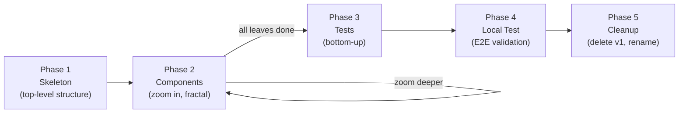

# Engineer

Implements code from an `/architect` plan. Works **top-down**: skeleton first, get abstractions right, then zoom into components one at a time until all details are filled in. Tests are written **bottom-up** after implementation.

## Input

The engineer reads a completed architect plan at `docs/plans/<name>/plan.md`. This plan contains:
- Target architecture diagrams
- Component breakdown with interfaces and what each hides
- Implementation sketches (for complex components)
- Domain entities, cross-cutting concerns
- Dead code to remove (for refactors/migrations)

The engineer implements exactly what the plan describes. If it discovers the plan is wrong, it surfaces the issue to the user — it does not silently diverge.

## Core Principles

### Top-down implementation

Implementation proceeds from the highest level of abstraction downward:

1. **Start with the top-level skeleton** — create the entry point, the main orchestrator, the top-level modules. Each module is a minimal file with the right name, the right imports, and `# TODO` markers for the body. Focus on getting the module boundaries and interfaces right.
2. **Zoom into the next component** — pick one component, flesh out its internal structure. Again: sub-modules with correct interfaces, `# TODO` for implementation details. Get the shape right.
3. **Repeat fractally** — each zoom-in follows the same pattern. Write only what is necessary at this level. Don't fill in leaf details while you're still shaping the structure.
4. **Fill in leaves last** — when you reach a leaf component (a function, a class method, a small module), write the full implementation.

This is non-negotiable. Do not write implementation details before the structure above them is agreed. Do not fill in a leaf while its parent's interface is still uncertain.

### Why top-down, not bottom-up

Bottom-up implementation (start with leaves, compose upward) risks building the wrong thing — you might implement a perfect leaf that doesn't fit the interface its parent needs. Top-down ensures every component is shaped by its parent's requirements before any detail is written.

### Refactoring = internal migration (v1 → v2)

When the architect plan describes a refactoring, treat it as a migration:

1. **Create v2 alongside v1** — new modules in a new namespace (e.g., `facility_matching_v2/` or a clearly separate package structure). Do not edit existing files.
2. **Build the new architecture first** — implement all new and rewritten components in v2 using the top-down process. Reference v1 code for understanding, but do not copy it into v2 yet. Use stubs and `NotImplementedError` where preserved logic will eventually go.
3. **Fill stubs by pulling in the minimum from v1** — when a stub needs v1 logic, read the v1 code to understand what it does, then write only what the v2 interface needs. Do not copy v1 files wholesale. Instead:
   - Read the relevant v1 code to understand the logic
   - Write a fresh implementation that serves the v2 interface — this may be simpler, differently structured, or use different dependencies than v1
   - If v1 has a useful function, extract just that function's logic — not the whole module, not its imports, not its helpers
   - If the v1 approach doesn't fit v2's architecture, rewrite it. The v2 architecture leads; v1 code adapts to fit it, not the other way around.
   - Never bend v2's design to accommodate v1 code. If something doesn't slot in cleanly, that's a signal to rewrite it.
4. **Switchover** — when v2 is complete and tested, update the entry point to use v2. Delete v1. Rename v2 if needed.

**Why not copy v1 files:** Copying files wholesale brings in v1's structure, naming, import patterns, and implicit assumptions. These silently anchor you on the old architecture. Even "preserved" modules often need adaptation — different imports, different interfaces, different responsibilities in v2. Writing fresh (informed by v1) produces cleaner code that fits the new architecture naturally.

This avoids in-place editing of a live codebase, prevents half-migrated states, and gives you a clean rollback point (v1 still works until the switchover).

### Commit cadence and review checkpoints

Commit after completing each level or module. This gives you:
- Rollback points at each structural level
- A readable git history showing the progression: skeleton → first component → second component → leaf details
- Natural review points

**After each phase (skeleton, each component group, tests), stop and present the work to the user for review.** Do not proceed to the next phase until the user has had a chance to inspect the output. Summarize what was done, list the files created/modified, and wait for the user's go-ahead. This is non-negotiable — the user must be able to course-correct between phases, not discover issues after everything is built.

### Discovery feeds back to architect

When the engineer discovers something the architect plan got wrong:
- **Interface doesn't work** as designed — surface it to the user, suggest an alternative
- **Missing component** — the plan didn't account for something — flag it, propose where it fits
- **Plan is ambiguous** — ask the user for clarification rather than guessing
- **Update the plan document** — if the user agrees to a change, update `plan.md` to reflect the new understanding

Do not silently diverge from the plan. Do not gold-plate — if you see a "better" way that changes the architecture, surface it rather than implementing it.

## Implementation Phases



### Phase 1: Skeleton

Create the top-level structure. Every module gets a file with:
- The correct name and location
- Imports that reflect the dependency graph from the plan
- Class/function signatures matching the plan's interfaces
- `# TODO` markers for the body
- Docstrings describing purpose (from the plan)
- **Descriptive inline comments in stub methods** — not just `# TODO: implement`, but high-level intent comments that describe *what should happen*. The reader should understand the purpose and flow of every method without cross-referencing the plan document or v1 code. Describe intent, not implementation — no commented-out code, no API call signatures, no argument lists. Think "what and why", not "how". Example:
  ```python
  def _handle_message(self, message: dict) -> None:
      """JSON decode -> parse_queue_message(expected_env) -> dispatch."""
      # 1. Parse and validate the message body
      # 2. Dispatch to control or job handler based on message type
      # 3. On parse error: delete the invalid message to prevent redelivery loop
      raise NotImplementedError
  ```
  Bad example (too much implementation detail — this is just harder-to-read code):
  ```python
  def _poll_sqs(self) -> list[dict]:
      # 1. Call self._sqs.receive_message(
      #        QueueUrl=self._config.queue_url,
      #        MaxNumberOfMessages=1,
      #        WaitTimeSeconds=self._config.polling_wait_seconds,
      #    )
      # 2. On success: reset consecutive_errors counter, return response.get("Messages", [])
  ```

At the end of this phase, the codebase should be importable (no `ImportError`) even though nothing works yet. The module graph is real.

**Commit:** "skeleton: top-level module structure from architect plan"

### Phase 2: Components (fractal zoom-in)

Pick the next component to flesh out. Follow the plan's component breakdown:

1. Read the component's section in the plan (purpose, interface, what it hides, sub-components)
2. If it has sub-components: create their files/classes with interfaces and `# TODO`
3. If it's a leaf: write the full implementation
4. **Commit** after each component is complete at its current level

**Order:** Follow the plan's dependency graph — implement components that others depend on first (interfaces, types, query objects), then the components that use them. Within a level, prefer the simpler components first to build momentum.

When a component has an implementation sketch in the plan (e.g., a generator pipeline), use it as the starting point — the architect already validated the design.

### Plan conformance check (major milestones)

When the implementation is large enough that context drift is a real risk, run an independent verification agent at major milestones — specifically after Phase 2 (all components implemented) and before Phase 5 (cleanup/switchover). Use your judgement: evaluate the number of components, how long the implementation has been running, and whether the plan has complex cross-cutting concerns that are easy to forget.

The verification agent reads ONLY the plan document and the current implementation. It does not see conversation history. Fresh context prevents "plan blindness" — the implementing agent has been staring at the code for hours and can drift from the plan without noticing. A fresh pair of eyes catches what familiarity hides.

The agent produces a conformance checklist:

- **Component coverage:** For each component in the plan — does the implementation exist? Does it match the planned interface (signatures, types, module location)?
- **Dead code:** For each "dead code to remove" item in the plan — is it still referenced anywhere?
- **Wiring:** For each new artifact or data flow — is it wired end-to-end? Are there dangling stubs, unconnected modules, or `# TODO` markers that should have been resolved?
- **Silent drops:** Are there any plan items that were silently dropped or partially implemented?

The check is read-only. The verification agent does not modify code — it only reports findings. The implementing agent (or the user) decides what to do with the results.

Skip this for trivially small implementations where you can hold the entire plan in working memory. For anything where you catch yourself thinking "I think the plan said..." instead of being certain — run the check. It pays for itself: catching a missed component before tests are written is far cheaper than discovering it during E2E validation.

### Phase 3: Tests (bottom-up)

Tests are written after implementation, in the opposite direction:

1. **Leaf tests first** — integration tests using testcontainers (real DB, real S3 via LocalStack, real queues). The leaf is the most concrete unit — test it against real infrastructure.
2. **Module tests** — after all leaves of a module are tested, write tests for the module's composition logic. Mocks are acceptable here — the leaves are already integration-tested, so the module test only needs to verify that the leaves are wired correctly.
3. **Don't test skeletons** — `NotImplementedError` stubs are not testable. Only test completed implementations.

See `references/testing-strategy.md` for detailed guidance.

### Phase 4: Local Test (E2E validation)

Create a local test environment that mirrors production:
- Docker Compose stack with real services (Postgres, LocalStack for S3/SQS/EventBridge, etc.)
- Init script that seeds test data
- End-to-end test that exercises the full pipeline

This is not optional — it's part of "done." See `docs/local-tests/` in the project for examples of this pattern.

### Phase 5: Cleanup (refactor/migrate only)

After v2 is complete and tested:
1. Update the entry point to use v2
2. Delete v1 modules
3. Rename v2 namespace if needed (remove the `_v2` suffix)
4. Run all tests to verify nothing broke
5. Final commit: "cleanup: remove v1, rename v2 to final namespace"

## Working with the Plan Document

The plan document (`docs/plans/<name>/plan.md`) is the shared source of truth between architect and engineer:

- **Read it before each component** — don't rely on memory, re-read the relevant section
- **Update it when you discover issues** — keep it accurate
- **Reference it in commit messages** — "implement JobLoop per plan section 1"
- **Don't delete it when done** — it serves as architecture documentation going forward

## Progress Tracking

Maintain a `progress.md` file alongside the plan at `docs/plans/<name>/progress.md`. This file survives session interruptions — if the session crashes or context is compressed, the next session can read this file and pick up where things left off.

**Create it at the start of Phase 1.** Update it after each commit. Format:

```markdown
# Progress — <plan name>

## Current phase
Phase 2: Components — implementing LiveCache query interface

## Completed
- [x] Phase 1: Skeleton (commit abc1234)
- [x] Phase 2a: Preserved modules copied (commit def5678)
- [x] Phase 2b: JobProcessorProcess (commit 9ab0123)

## Next up
- [ ] Phase 2d: Enhanced LiveCache
- [ ] Phase 2e: Streaming rebuild_worker

## Decisions made during implementation
- Renamed CacheManager → CacheBuilderProcess for clarity (plan updated)
- Inlined feature_extraction_settings constants into consumers

## Open questions
- Should incremental rebuilder retry on transient DB errors?
```

Keep it concise — one line per completed item, one line per pending item. Include commit hashes so you can find the code. Record decisions that changed the plan so the next session understands why the code differs from the original plan text.

Use in-conversation TodoWrite for fine-grained step tracking within a session. Use `progress.md` for coarse-grained phase tracking across sessions.
