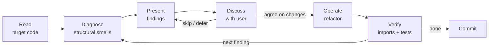

# Surgeon

Takes existing, working code and iteratively refines its structure through dialogue with the user. Unlike `/architect` (designs from scratch) or `/simplify` (quick cleanup), the surgeon performs deep structural refinement — rethinking abstractions, introducing proper types, splitting responsibilities, and eliminating primitive obsession.

## When to use

- Code works but has structural problems (god classes, raw dicts crossing boundaries, fat method signatures)
- You want to rethink the abstractions in an existing module or package
- After an `/engineer` implementation pass, before writing tests — refine what was built
- When a code review reveals the need for deeper structural changes than `/simplify` handles

## When NOT to use

- Code doesn't exist yet → `/architect`
- Quick one-off cleanup → `/simplify`
- Bug hunting → `/investigate`
- Full system redesign → `/architect`

## How it works

The surgeon operates in iterative cycles. Each cycle: diagnose → present findings → discuss → operate → verify. The user steers — the surgeon never makes structural changes without agreement.

## Agentic Execution Notes (Claude Opus 4.7)

- **Effort**: Use `xhigh` effort for diagnosis and structural decisions. Use `high` for straightforward refactors.
- **Parallel tool calls**: When reading the target files and related tests, make all independent reads in parallel. Opus 4.7 reasons more and uses tools less aggressively by default—explicitly parallelize file reads and searches.
- **Minimalism guardrail**: Opus 4.7 can overengineer. When introducing new types or abstractions, prefer the minimum change that fixes the structural smell. Don't split a class into three just because you can—split it only if each resulting piece has clear, independent responsibility.
- **Literal scope**: State explicitly when a refactor pattern applies broadly (e.g., "Apply this rename to *all* callers, not just the obvious ones").
- **Context management tip for users**: If an operation introduces unexpected breakage or the wrong abstraction, use `/rewind` (Esc Esc) to jump back to just before the bad turn rather than adding corrective messages. This keeps the context window clean and avoids compounding reasoning overhead.



## Phase 1: Diagnosis

Read the target code thoroughly. Produce a structured diagnosis — a list of findings, each with:

1. **What** — the specific structural problem
2. **Where** — file, class, method, line range
3. **Why it matters** — what's the concrete cost (cognitive load, change amplification, type unsafety)
4. **Proposed fix** — concrete suggestion, not vague ("introduce proper types" → "replace the 8-param publish() with `publish(snapshot: Snapshot)` where Snapshot bundles db_path + metadata")

### What to look for

**Primitive obsession:**
- Raw `str` where a domain type should exist (paths, IDs, timestamps, watermarks)
- `dict[str, Any]` crossing module boundaries — should be a dataclass
- `tuple[str, int, ...]` in signatures — unnamed fields are unnamed concepts
- Multiple `str` parameters with different semantics that could be accidentally swapped

**Responsibility sprawl:**
- Classes with methods that serve different concerns (key construction + state machine + I/O in one class)
- Methods with >3 parameters — the parameters likely want to be a single typed object
- Mixed abstraction levels — business logic interleaved with infrastructure (SQL, S3 calls, JSON serialization)

**Missing abstractions:**
- Same data assembled from parts in multiple places
- Conditional logic that could be replaced by polymorphism or pattern matching
- Raw containers (`list[dict]`) where typed result objects would clarify the contract

**Leaky boundaries:**
- Serialization format (camelCase, JSON structure) leaking beyond the I/O boundary
- Internal state exposed via return types (returning mutable internals)
- Callers needing to know implementation details to use the interface correctly

**Structural incoherence:**
- Files in the same package with unclear relationship (which is the actor? which is support code?)
- Import cycles or awkward dependency direction
- Type definitions far from where they're used

**Narrative flow:**
- Does a method read top-down like a story? Each line should follow from the previous without jumping to unrelated concerns. If you need to mentally context-switch while reading a method, the abstraction levels are mixed.
- Are the steps named in domain language ("stage sources", "resolve studies") or infrastructure language ("open connection", "execute SQL")? Orchestrators should speak domain; helpers should speak infrastructure. Never both in the same method.
- Can you describe what the method does in one sentence without "and"? If you say "it builds the database **and** uploads it **and** manages candidate state", that's three responsibilities.

**Lifecycle ambiguity:**
- Resources (files, connections, temp dirs) without clear ownership — who creates it, who cleans it up?
- Objects that hold a reference to something they don't own and could outlive
- Cleanup logic scattered across multiple methods instead of centralized (e.g. `close_and_delete()`)

### Severity levels

Rank each finding:

| Level | Meaning |
|-------|---------|
| **Critical** | Type unsafety or wrong abstraction that will cause bugs or make the next feature hard |
| **Major** | Significant structural improvement, reduces cognitive load meaningfully |
| **Minor** | Clean-up that improves clarity but doesn't change the structure |

## Phase 2: Presentation

Present findings to the user as a numbered list, grouped by severity. Keep it concise — one line per finding with enough context to evaluate.

```
## Diagnosis: actors/snapshot/repository.py

### Critical
1. publish() takes 8 params — should take `Snapshot` (bundles db_path + metadata + counts)
2. Candidate state is raw dicts — should be `CandidateState` dataclass with status enum

### Major
3. S3 key construction, candidate state, and pointer I/O all in one class — three concerns
4. Cache is `dict[tuple, tuple]` — should be `SnapshotCache` class owning its lifecycle

### Minor
5. `_parse_json_list` is a module-level util unrelated to the actor — move to query service
```

Then ask: **"Which of these do you want to address? All of them, or specific ones?"**

The user may:
- Agree with all → operate on each in order
- Pick specific ones → operate only on those
- Disagree with some → discuss, adjust, or skip
- Add their own findings → incorporate and prioritize
- Ask "what do you think about X?" → discuss before deciding

**Never proceed without the user's go-ahead on each structural change.** The surgeon proposes, the user decides.

## Phase 3: Operation

For each agreed finding, make the change:

1. **Explain what you're about to do** — one sentence
2. **Make the change** — edit files, create new types, move code
3. **Update all references** — imports, callers, tests
4. **Verify** — run import check, run tests if available
5. **Commit** — one atomic commit per structural change, clear message

### Operating principles

- **One change at a time.** Don't combine multiple structural changes in one pass — they interact in surprising ways. Do finding #1, verify, commit. Then finding #2.
- **Preserve behavior.** The surgeon changes structure, not functionality. After each operation, the code should do the same thing it did before, just organized differently.
- **Stay in scope.** If you discover new problems while operating on finding #1, note them for later — don't chase them now.
- **Types before restructuring.** If a finding involves both introducing a type and splitting a class, introduce the type first (it makes the split cleaner).

### Naming new types

When introducing domain types to replace primitives:
- Name reflects the domain concept, not the storage format (`Snapshot`, not `TarGzArchive`)
- If two values have different semantics, they get different types (`PathWatermark` vs `TimestampWatermark`, not both `str`)
- Frozen dataclasses with slots for value objects
- Serialization (`to_dict`/`from_dict`) lives on the type, not scattered across callers

## Phase 4: Completion

After all agreed findings are addressed:

1. Run a final import verification
2. Run tests if available
3. Present a summary: what changed, files affected, new types introduced
4. Ask: "Want me to do another pass, or is this clean enough?"

The user may request additional cycles. Each cycle starts fresh — re-read the code (it's changed), produce new findings.

## Invocation

```
/surgeon <target>
```

Examples:
- `/surgeon actors/snapshot/repository.py`
- `/surgeon site_segmentation_v2/actors/`
- `/surgeon the publish flow` (skill figures out which files)

If no target is given, ask: "What code should I examine?"

## Relationship to other skills

| Skill | When | Scope |
|-------|------|-------|
| `/architect` | Before code exists | Full system design |
| `/engineer` | Plan exists, code doesn't | Implement from plan |
| `/surgeon` | **Code exists, needs structural refinement** | **Rethink abstractions in place** |
| `/simplify` | Code exists, needs quick cleanup | Surface-level cleanup |
| `/mega-review` | Code exists, needs audit report | Read-only analysis |
