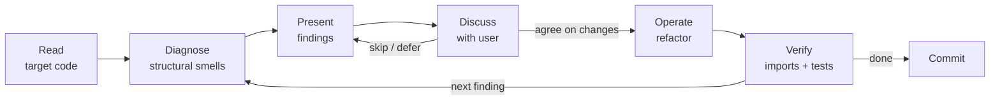

# Surgeon

Takes existing, working code and iteratively refines its structure through dialogue with the user. Unlike `/architect` (designs from scratch) or `/simplify` (quick cleanup), the surgeon performs deep structural refinement — rethinking abstractions, introducing proper types, splitting responsibilities, and eliminating primitive obsession.

## When to use

- Code works but has structural problems (god classes, raw dicts crossing boundaries, fat method signatures)
- You want to rethink the abstractions in an existing module or package
- After an `/engineer` implementation pass, before writing tests — refine what was built
- When a code review reveals the need for deeper structural changes than `/simplify` handles

## When NOT to use

- Code doesn't exist yet → `/architect`
- Quick one-off cleanup → `/simplify`
- Bug hunting → `/investigate`
- Full system redesign → `/architect`

## How it works

The surgeon operates in iterative cycles. Each cycle: diagnose → present findings → discuss → operate → verify. The user steers — the surgeon never makes structural changes without agreement.

## Session Artifact

Surgeon uses a durable markdown file to manage findings across sessions. This makes the workflow scale-invariant: a 16-finding diagnosis does not blow up the conversation context.

**Artifact path:**
```
.docs/surgeon/YYYY-MM-DD-<scope-slug>-<random5>.md
```

**Ensure `.docs/` is in `.gitignore`** before creating the directory. These are working notes, not source code, but the user may opt to commit them alongside the work.

**Keep the file lean:** Verdicts should be 1–2 sentences. `Notes for downstream` should only capture conventions that later findings *need* to know (not a full changelog). If the artifact grows past ~50 lines, consider starting a fresh one for the next cycle.

### Resume protocol

If the user invokes `/surgeon` with a path to an existing surgeon notes file (e.g., `/surgeon .docs/surgeon/2026-04-16-actors-snapshot-x8k2f.md`):

1. Read the file.
2. Identify the next un-addressed finding.
3. Jump directly to **Phase 2** for that finding: present it, discuss, get verdict, operate.

If no path is given, proceed with a fresh diagnosis (Phase 1) and create a new artifact file.

## Agentic Execution Notes (Claude Opus 4.7)

- **Effort**: Use `xhigh` effort for diagnosis and structural decisions. Use `high` for straightforward refactors.
- **Parallel tool calls**: When reading the target files and related tests, make all independent reads in parallel. Opus 4.7 reasons more and uses tools less aggressively by default—explicitly parallelize file reads and searches.
- **Minimalism guardrail**: Opus 4.7 can overengineer. When introducing new types or abstractions, prefer the minimum change that fixes the structural smell. Don't split a class into three just because you can—split it only if each resulting piece has clear, independent responsibility.
- **Literal scope**: State explicitly when a refactor pattern applies broadly (e.g., "Apply this rename to *all* callers, not just the obvious ones").
- **Context management tip for users**: If an operation introduces unexpected breakage or the wrong abstraction, use `/rewind` (Esc Esc) to jump back to just before the bad turn rather than adding corrective messages. This keeps the context window clean and avoids compounding reasoning overhead.



## Phase 1: Diagnosis

Read the target code thoroughly. Produce a structured diagnosis — a list of findings, each with:

1. **What** — the specific structural problem
2. **Where** — file, class, method, line range
3. **Why it matters** — what's the concrete cost (cognitive load, change amplification, type unsafety)
4. **Proposed fix** — concrete suggestion, not vague ("introduce proper types" → "replace the 8-param publish() with `publish(snapshot: Snapshot)` where Snapshot bundles db_path + metadata")

### Creating the artifact

Write the full diagnosis to the artifact file **before** presenting it in chat. The file is the contract.

```markdown
# Surgeon Notes — <scope>
**Created:** YYYY-MM-DD
**Target:** <file or module>

## Legend
- [ ] Pending
- [~] In progress
- [x] Done
- [-] Skipped / rejected

## Findings

### Critical
- [ ] **C1:** <what> — <where>
  - **Why:** <cost>
  - **Fix:** <concrete suggestion>

### Major
- [ ] **M1:** ...

### Minor
- [ ] **m1:** ...

## Verdicts
(Recorded as findings are addressed.)

## Notes for downstream
(Append conventions, commits, and learnings as work proceeds.)
```

After writing the file, present a brief summary in chat: "Diagnosis written to `.docs/surgeon/<file>`. {N} findings: {X} critical, {Y} major, {Z} minor. Ready to address the first one?"

### What to look for

**Primitive obsession:**
- Raw `str` where a domain type should exist (paths, IDs, timestamps, watermarks)
- `dict[str, Any]` crossing module boundaries — should be a dataclass
- `tuple[str, int, ...]` in signatures — unnamed fields are unnamed concepts
- Multiple `str` parameters with different semantics that could be accidentally swapped

**Responsibility sprawl:**
- Classes with methods that serve different concerns (key construction + state machine + I/O in one class)
- Methods with >3 parameters — the parameters likely want to be a single typed object
- Mixed abstraction levels — business logic interleaved with infrastructure (SQL, S3 calls, JSON serialization)

**Missing abstractions:**
- Same data assembled from parts in multiple places
- Conditional logic that could be replaced by polymorphism or pattern matching
- Raw containers (`list[dict]`) where typed result objects would clarify the contract

**Leaky boundaries:**
- Serialization format (camelCase, JSON structure) leaking beyond the I/O boundary
- Internal state exposed via return types (returning mutable internals)
- Callers needing to know implementation details to use the interface correctly

**Structural incoherence:**
- Files in the same package with unclear relationship (which is the actor? which is support code?)
- Import cycles or awkward dependency direction
- Type definitions far from where they're used

**Narrative flow:**
- Does a method read top-down like a story? Each line should follow from the previous without jumping to unrelated concerns. If you need to mentally context-switch while reading a method, the abstraction levels are mixed.
- Are the steps named in domain language ("stage sources", "resolve studies") or infrastructure language ("open connection", "execute SQL")? Orchestrators should speak domain; helpers should speak infrastructure. Never both in the same method.
- Can you describe what the method does in one sentence without "and"? If you say "it builds the database **and** uploads it **and** manages candidate state", that's three responsibilities.

**Lifecycle ambiguity:**
- Resources (files, connections, temp dirs) without clear ownership — who creates it, who cleans it up?
- Objects that hold a reference to something they don't own and could outlive
- Cleanup logic scattered across multiple methods instead of centralized (e.g. `close_and_delete()`)

### Severity levels

Rank each finding:

| Level | Meaning |
|-------|---------|
| **Critical** | Type unsafety or wrong abstraction that will cause bugs or make the next feature hard |
| **Major** | Significant structural improvement, reduces cognitive load meaningfully |
| **Minor** | Clean-up that improves clarity but doesn't change the structure |

## Phase 2: Presentation

The file is the contract. For each finding, read it from the artifact, present it in chat, discuss, and record the verdict back into the file.

**Presentation format in chat:**
```
## Next finding: C1 — publish() takes 8 params
**Where:** actors/snapshot/repository.py:42
**Why it matters:** <cost>
**Proposed fix:** <concrete suggestion>

Proceed with this change? (yes / no / modify / skip)
```

### Recording verdicts

After the user decides, append a `## Verdict` block to the artifact **before operating**:

```markdown
## Verdict: C1
- **Decision:** Accepted / Rejected / Modified / Deferred
- **Rationale:** <user reasoning>
- **Adjusted fix:** <if modified>
```

Update the finding's checkbox in the file:
- Accepted / Modified → `[~]`
- Done → `[x]`
- Rejected / Deferred / Skipped → `[-]`

The user may:
- Agree with the finding → operate on it
- Pick a different finding → jump to that one
- Disagree → discuss, adjust the verdict, and update the file
- Add their own findings → append to the artifact and prioritize
- Ask "what do you think about X?" → discuss before deciding

**Never proceed without the user's go-ahead on each structural change.** The surgeon proposes, the user decides.

## Phase 3: Operation

For each agreed finding, make the change:

1. **Explain what you're about to do** — one sentence
2. **Make the change** — edit files, create new types, move code
3. **Update all references** — imports, callers, tests
4. **Verify** — run import check, run tests if available
5. **Commit** — one atomic commit per structural change, clear message

### Operating principles

- **One change at a time.** Don't combine multiple structural changes in one pass — they interact in surprising ways. Do finding #1, verify, commit, checkpoint to the artifact. Then finding #2.
- **Preserve behavior.** The surgeon changes structure, not functionality. After each operation, the code should do the same thing it did before, just organized differently.
- **Stay in scope.** If you discover new problems while operating on finding #1, note them for later — don't chase them now.
- **Types before restructuring.** If a finding involves both introducing a type and splitting a class, introduce the type first (it makes the split cleaner).

### Notes for downstream

After each verified commit, append a block to the artifact under `## Notes for downstream`:

```markdown
### Notes for downstream — after C1
- **Commit:** <SHA or message>
- **What landed:** <brief summary>
- **Conventions established:** <patterns later findings should follow>
- **Deferred decisions:** <anything left unresolved>
```

This is the hand-off that makes the next clear session coherent. Mark the finding `[x]` in the file. Then suggest: "Finding complete and checkpointed. Want to continue in this session, or clear context and resume from the artifact for the next finding?"

### Naming new types

When introducing domain types to replace primitives:
- Name reflects the domain concept, not the storage format (`Snapshot`, not `TarGzArchive`)
- If two values have different semantics, they get different types (`PathWatermark` vs `TimestampWatermark`, not both `str`)
- Frozen dataclasses with slots for value objects
- Serialization (`to_dict`/`from_dict`) lives on the type, not scattered across callers

## Phase 4: Completion

After all agreed findings are addressed:

1. Run a final import verification
2. Run tests if available
3. Append a final summary to the artifact
4. Present a summary in chat: what changed, files affected, new types introduced
5. Ask: "Want me to do another pass, or is this clean enough?"

The user may request additional cycles. Each cycle starts fresh — re-read the code (it's changed), append new findings to the same artifact or create a new one.

## Invocation

```
/surgeon <target>
```

Examples:
- `/surgeon actors/snapshot/repository.py`
- `/surgeon site_segmentation_v2/actors/`
- `/surgeon the publish flow` (skill figures out which files)

If no target is given, ask: "What code should I examine?"

## Relationship to other skills

| Skill | When | Scope |
|-------|------|-------|
| `/architect` | Before code exists | Full system design |
| `/engineer` | Plan exists, code doesn't | Implement from plan |
| `/surgeon` | **Code exists, needs structural refinement** | **Rethink abstractions in place** |
| `/simplify` | Code exists, needs quick cleanup | Surface-level cleanup |
| `/mega-review` | Code exists, needs audit report | Read-only analysis |
